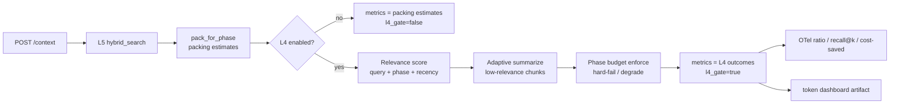

# Implementation Plan: EP-008 L4 Context Compression, Token Budgets & Cost Telemetry

**Branch**: `feature/ep-008-l4-compression-budgets-telemetry` | **Date**: 2026-07-29 | **Spec**: [spec.md](./spec.md)

**Input**: Feature specification from `/specs/ep-008-l4-compression-budgets-telemetry/spec.md`

## Summary

EP-008 delivers V1 **L4 Headroom-style** compression on the existing Confirmed `POST /context` path: adaptive summarization with symbol/TODO preservation and a recall@10 gate (US-023 / FR-001–004), per-phase token budgets with hard-fail + degradation (US-022 / FR-005–006), and OTel-compatible compression telemetry plus a minimal token cost dashboard (US-024 / FR-007–009). FastAPI owns CompressionService (ADR-002 / Constitution V). MVP packing metrics from `l5_phase_pack.py` remain packing estimates when L4 is off; when L4 runs, Confirmed `tokens_before` / `tokens_after` / `saving_percent` become **L4-meaningful** (A-06 / ADR-006). No L1 (EP-006/007) or OKF (EP-013) redesign. **OQ-07** stays blocking for canonical Dev numeric AC; **OQ-08** / **OQ-09** stay unresolved for serving / exporter vendor.

## Technical Context

**Language/Version**: Python 3.11 / FastAPI (Confirmed orchestrator).

**Primary Dependencies**: Existing L5 pack/search (`l5_phase_pack.py`, `l5_pack.estimate_tokens`, `hybrid_search`), IgnorePolicy, `consent_gate` (US-016), optional L3 symbol surfaces for preservation checks (US-005 dependency — reuse, no Serena redesign). Headroom-style compressor is **Confirmed direction** (ADR-006; backend-architecture `CompressionService` + `Headroom-style compressor` adapter). Exact Headroom library pin / local extractive summarizer: **Proposed** (see Technical Approach). OpenTelemetry API already used in `app/telemetry/*` (exporter-agnostic; ADR-011).

**Storage**: No new graph/vector store. Phase budgets: **Proposed** config/settings (env or settings module) — not a Confirmed DB schema. Dashboard artifact: filesystem/static or API-served HTML — serving **[NEEDS CLARIFICATION: OQ-08]**. Telemetry sink vendor **[NEEDS CLARIFICATION: OQ-09]**.

**Testing**: pytest unit / integration / contract under `services/orchestrator/tests/`. Measurable gates (60–95% savings, recall@10 >0.92, symbol preservation) are validation targets until harnesses execute. Dev numeric budget fixtures gated on OQ-07.

**Target Platform**: Local/VPC Docker Compose POC (Confirmed). No new Compose service required for CompressionService itself.

**Project Type**: FastAPI orchestrator monorepo service; thin CLI/VS Code consumers only.

**Performance Goals**: Compression savings 60–95% vs naive packing; recall@10 >0.92 (BRD §10). Illustrative KPI 85k→7.2k / 91% is narrative only (BRD §12). No new Confirmed L4-only p95 invent beyond existing ask narratives.

**Constraints**: ADR-009 Confirmed HTTP surface only — plug L4 into `POST /context` without inventing Confirmed request/response fields unless FR-justified and labeled **Proposed**. Consent before external LLM summarize. IgnorePolicy on all summarize paths. Do not redesign L1/OKF.

**Scale/Scope**: US-023 (P1), US-022 (P1), US-024 (P2). Excludes full UI design suite, EP-009 PR bot, L2/L6, L1/OKF redesign.

## ContextOS Technical Impact

| Layer / surface | Plan impact |
|---|---|
| **L4** | **Affected — Confirmed.** Relevance scoring, adaptive summarization, phase budgets, compression telemetry. |
| **L5** | **Integration only.** Consume `pack_for_phase` / hits; do not redesign packing or hybrid search. Metrics semantics upgrade when L4 runs. |
| **L3** | **Dependency.** Symbol/type preservation gates use existing symbol capability; no Serena redesign. |
| **L1 / L2 / L6** | **N/A redesign.** L1/OKF enrichment already in pipeline may remain upstream of L4; L4 does not own them (FR-012). |
| **FastAPI** | **Owns** CompressionService, budget enforcement, consent/ignore, OTel emission, dashboard artifact delivery (serving TBD). |
| **CLI / VS Code** | Thin consumers of `/context`; must not bypass consent/ignore/telemetry opt-out. No Confirmed new Webview for dashboard. |
| **Dashboard** | Minimal `contextos_token_dashboard.html` (or equivalent); no design-system suite. |
| **Observability** | OTel-compatible compression ratio, recall@k, cost-saved; exporter vendor open (OQ-09). |
| **Measurable claims** | SC-001..SC-006 — validation targets; no pass without executed harnesses. |

## Constitution Check

| Gate | Status | Evidence / mitigation |
|---|---|---|
| I — Evidence-first | **Pass** | FR-001..012 cite BRD FR-11..13, ADR-006/009/011, api-contract §2.3; OQ-07/08/09 retained as NEEDS CLARIFICATION. |
| II — Six-layer integrity | **Pass** | L4 delivery only; L5/L3 consume/reuse; L1/OKF out of redesign (FR-012). |
| III — Privacy/security | **Pass with obligations** | Consent gate for external summarize (FR-004); IgnorePolicy + provenance (FR-011); no index-time LLM. |
| IV — Measurable claims | **Conditional** | Savings / recall / symbol gates planned with fixtures; Dev numeric AC blocked on OQ-07. |
| V — Surface boundaries | **Pass** | FastAPI owns L4 (FR-010); clients thin; dashboard presentation only. |
| Roadmap governance | **Pass** | V1 L1+L4 slice for L4; does not pull V2 L2/L6. |

**Post-design re-check**: Plan adds Proposed CompressionService behind Confirmed `/context` metrics keys; Proposed status codes and dashboard route remain labeled Proposed; no Confirmed Dev budget invented. No constitution violation requiring Complexity Tracking.

## Project Structure

### Documentation (this feature)

```text
specs/ep-008-l4-compression-budgets-telemetry/
├── spec.md
├── plan.md              # this file
├── tasks.md             # task-generator (not this artifact)
└── validation-report.md # after Spec Kit triad
```

### Source (Proposed module placement — names align with backend-architecture.puml)

```text
services/orchestrator/app/
├── api/context.py                 # integrate L4 after pack_for_phase (modify)
├── api/schemas_context.py         # keep Confirmed metrics keys; Proposed status/docs only
├── services/l5_phase_pack.py      # packing estimates remain when L4 off (reuse)
├── services/l4_compression.py     # Proposed CompressionService (new)
├── services/l4_budgets.py         # Proposed phase budget + hard-fail/degrade (new)
├── services/l4_relevance.py       # Proposed relevance scoring (new)
├── adapters/headroom_summarizer.py # Proposed local/extractive or consented LLM adapter (new)
├── security/consent_gate.py       # reuse for external summarize
├── security/ignore_policy.py      # reuse
├── telemetry/context.py           # extend / sibling telemetry/compression.py (Proposed)
└── static/ or templates/          # Proposed location for contextos_token_dashboard.html (OQ-08)

services/orchestrator/tests/
├── unit/          # relevance, summarize preserve, budgets, consent, metrics math
├── integration/   # POST /context with L4 on/off; dashboard artifact
├── contract/      # Confirmed metrics keys unchanged
└── eval/ or fixtures/  # large naive pack + recall@10 harness (opt-in)
```

**Structure Decision**: Follow existing `app/services` + `app/telemetry` + `app/security` split. CompressionService is a **V1 domain service** per `docs/architecture/backend-architecture.puml` (`S_Comp` → `A_HR`). Exact file names above are **Proposed**.

## Complexity Tracking

Not applicable — no constitution violation. New L4 modules follow existing service/adapter boundaries.

## Technical Approach

### Confirmed architecture reused

| Item | Evidence |
|---|---|
| FastAPI owns compression | ADR-002; Constitution V; architecture-overview FR-11..13 mapping |
| L4 Headroom in V1 (not MVP gate) | ADR-006 |
| `POST /context` Confirmed metrics keys | api-contract §2.3: `tokens_before`, `tokens_after`, `saving_percent`, `trace` |
| Today those keys = packing estimates | `l5_phase_pack.pack_for_phase` (`tokens_before` = raw hit content estimate; `tokens_after` = packed body; `saving_percent` from that delta). Trace currently sets `l4_gate: False`. |
| Consent gate for query-time external LLM | `consent_gate.py` (US-016); EP-001 note that full L4 was out of scope |
| OTel-compatible spans already on `/context` | `app/telemetry/context.py` (exporter-agnostic; OQ-09) |
| Phase-aware packing exists | `pack_for_phase` + Proposed `phase` on request (OQ-16) — US-004 upstream for US-022 |
| Appendix D HTTP surface | ADR-009 — no new Confirmed endpoints without FR justification |

### Proposed architecture (EP-008)



1. **Placement in `/context` (Proposed)**: After `pack_for_phase` (and after existing OKF/L1/L3 enrichment that already mutates `final_context`, or immediately after pack — **Proposed default**: compress the assembled pack **before** optional enrichment that only appends small cited blocks, **or** compress the final string once after enrichment if enrichment can inflate tokens. Prefer: **run L4 on the packed body that will be returned**, documenting order in `metrics.trace` (`l4_stage_order`). Do **not** change Confirmed response field set.
2. **CompressionService (Proposed)**: New service implementing Headroom-style pipeline: score → summarize low-score units → re-estimate tokens → emit CompressionResult (`tokens_before`, `tokens_after`, `saving_percent`, compressed text, provenance notes).
3. **Relevance scoring (Confirmed intent; algorithm Missing Evidence)**: Score files/chunks by **query similarity + SDLC phase role + recency** (BRD §14). **Proposed v1 heuristic**: reuse existing hit scores from hybrid search where available; boost phase-aligned `phase_role`; optional mtime/recency signal if present on pack hits — else omit recency without inventing store fields. Exact formula labeled Proposed in code comments/tests.
4. **Adaptive summarization (US-023)**: For low-relevance units, replace bodies with summaries that **preserve symbols, types, TODOs** (FR-002). **Proposed** primary path: local extractive/heuristic summarizer (signatures + TODO lines + type/def lines) so consent is not required for the default path. **External LLM summarize** only when `evaluate_query_time_llm` allows (FR-004); otherwise skip external and keep local/heuristic path (no silent exfil).
5. **Phase budgets (US-022)**: Configurable map phase → max tokens. Enforce after compression (and optionally mid-degradation loops). **Hard-fail** when budget cannot be met; **degradation** = further drop/summarize lowest-relevance units (**Proposed** iterative prune — exact step table Missing Evidence / OQ-EP008-a). **Design=32k** may be used as evidenced fixture example (FR-11). **Dev canonical value NOT Confirmed** until OQ-07 — tests use injectable budget fixtures, not hard-coded Dev=8k/12k as product truth.
6. **Metrics semantics (FR-007)**:
   | Mode | `tokens_before` | `tokens_after` | `saving_percent` | `trace.l4_gate` |
   |---|---|---|---|---|
   | L4 off / unavailable | Packing estimate (current) | Packing estimate | Packing delta | `false` |
   | L4 on | Naive/pre-compress estimate (pack or raw candidates — **Proposed**: pre-L4 token count) | Post-L4 compressed | L4 savings | `true` + ratio / budget status |
7. **HTTP fields**: No new Confirmed request/response properties. **Proposed** (non-Confirmed): budget hard-fail → `413`/`422`; degraded serve → `503` or 200 with `trace.degraded` (api-contract §2.3 Proposed codes — do not treat as Confirmed). Prefer documenting outcome in `metrics.trace` even on 200 when product chooses soft degrade.
8. **Telemetry (US-024)**: Extend OTel attributes/metrics: `compression.ratio`, `compression.recall_at_k` (when measured), `compression.cost_saved` (token-delta and/or configurable rate table — rates Missing Evidence; may emit token-saved as primary). Honor any configured telemetry opt-out without inventing opt-out API (OQ-EP008-b).
9. **Dashboard (FR-009)**: Ship minimal `contextos_token_dashboard.html` showing before/after token cost from recent compress events or static demo fixture. Serving: **Proposed default for implementation** = static file under orchestrator static mount **or** sibling of `graph.html` pattern — **not Confirmed**; final choice waits on OQ-08. Do not invent Confirmed `GET /metrics` contract; if implemented, label Proposed (api-contract §3).

### Missing Evidence (do not invent Confirmed)

- Canonical Dev budget (OQ-07)
- Dashboard serving (OQ-08) and auth
- OTel collector/exporter vendor (OQ-09)
- Exact degradation algorithm steps
- Cost $ rate table for BO-02 $0.50→$0.05
- Telemetry opt-out API shape
- Headroom library version pin (style Confirmed; package pin open)

## Architecture Impact

| Area | Impact |
|---|---|
| Frontend | Minimal HTML dashboard only; no VS Code Webview required; no full UI suite |
| Backend | CompressionService + budget/relevance modules; `/context` integration; optional Proposed dashboard route/static |
| Database | None Confirmed |
| Infrastructure | OTel exporter config TBD (OQ-09); no new required store |
| AI Components | Optional consented external LLM summarize; default Proposed local/heuristic path |

## Components

| Component | Action | Status |
|---|---|---|
| `CompressionService` (`l4_compression.py`) | Create | Proposed |
| Relevance scorer (`l4_relevance.py`) | Create | Proposed |
| Budget enforcer (`l4_budgets.py`) | Create | Proposed |
| Summarizer adapter (`adapters/headroom_summarizer.py`) | Create | Proposed |
| `POST /context` (`api/context.py`) | Modify — call L4 when enabled; set L4-meaningful metrics | Confirmed endpoint / Proposed L4 wiring |
| `l5_phase_pack.py` | Keep packing estimates; do not pretend they are L4 | Confirmed baseline |
| `consent_gate.py` / IgnorePolicy | Reuse on summarize path | Confirmed controls |
| `telemetry/compression.py` or extend `telemetry/context.py` | Emit FR-13 metrics | Proposed attribute names |
| `contextos_token_dashboard.html` | Create minimal artifact | Confirmed name; serving Proposed |
| Config/settings | Feature flag `l4_enabled`, phase budget map, optional rate table | Proposed |
| CLI / VS Code | No new Confirmed verbs/Webviews | Optional regression only |

## Data Model Changes

No Confirmed persistence schema. **Proposed** in-memory / config entities:

| Entity | Notes |
|---|---|
| `PhaseBudget` | phase → max_tokens; Design example 32k; Dev value injectable until OQ-07 |
| `CompressionResult` | tokens_before/after, saving_percent, final_context, provenance, ratio |
| `RelevanceScore` | per file/chunk score + reasons |
| Telemetry event | compression_ratio, recall@k, cost_saved (names Confirmed FR-13; schema Proposed) |

Migration: **None**.

## API Design

| Endpoint | Change |
|---|---|
| `POST /context` | **Behavior**: optional L4 compress + budget enforce. **Confirmed fields unchanged.** Metrics become L4-meaningful when L4 runs (FR-007). Trace gains Proposed `l4_*` notes. |
| New Confirmed endpoints | **None** (ADR-009). |
| `GET /metrics` or static dashboard | **Proposed only** (api-contract §3; OQ-08). |

**Error handling (Proposed, not Confirmed)**: `413`/`422` budget hard-fail; `403` consent denial if external path attempted without consent; `503` degraded — align with existing Proposed status table; prefer explicit `metrics.trace` codes even when HTTP stays 200 for soft degrade.

## UI / UX Changes

Minimal operator-facing HTML token dashboard (before/after tokens). **No** full design suite, no Confirmed VS Code Webview. Accessibility: basic readable HTML only — no invented a11y numeric targets.

## Security Considerations

| Control | Plan |
|---|---|
| Authentication / RBAC | Platform control Confirmed; concrete dashboard/API auth schema Missing Evidence — do not invent. |
| Consent | External LLM summarize requires `consent_gate`; deny-by-default; local path when configured. |
| IgnorePolicy | Summarize only allowed pack content; never re-read excluded paths from disk. |
| Provenance | Preserve path/citation attributes through compression (FR-011). |
| Secrets | No `.env`/secret bodies in summarize or telemetry payloads. |
| Client bypass | CLI/extension must not skip backend consent/ignore/opt-out (FR-010). |

## Performance Considerations

- Compress only when L4 enabled; packing-only path remains for MVP/disable (A-06).
- Prefer local/heuristic summarize for latency; external LLM optional and consented.
- Budget enforcement is CPU-local over already-retrieved packs — no new store round-trips required.
- Large-pack fixtures for 60–95% / recall gates are eval/opt-in, not every unit test.
- Caching of compressed packs: **Not evidenced** — do not invent Confirmed cache unless later ADR.

## Testing Strategy

### Unit Tests

- Relevance ordering (query/phase/recency signals as available).
- Summarizer preserves symbol/type/TODO lines (FR-002).
- Savings math and L4 vs packing metric distinction.
- Budget: under-budget success; over-budget degradation then hard-fail (injectable ceilings).
- Consent: no external call without consent; local path allowed.
- IgnorePolicy: excluded paths never enter summarize input.

### Integration Tests

- `POST /context` with L4 off → packing-estimate metrics, `l4_gate=false`.
- `POST /context` with L4 on → meaningful L4 metrics; `final_context` compressed.
- Design=32k fixture enforcement (evidenced example).
- Dev numeric AC tests **skipped/gated** until OQ-07 resolved (use parameterized injectable budgets only).

### Contract Tests

- Confirmed metrics keys still present; no new required Confirmed response properties.
- OpenAPI description updated to note L4-meaningful metrics when compression runs (Proposed wording).

### End-to-End / Eval (opt-in)

- Large naive pack fixture → savings in **60–95%** (SC-001) — no pass claim without run.
- Recall@10 harness **>0.92** (SC-002) — agreed fixture set; no pass without run.
- Symbol-preservation suite as BRD §13 mitigation.

### Acceptance / Regression

- Map US-023 → FR-001..004; US-022 → FR-005..006; US-024 → FR-007..009.
- Regression: L1 blast/graph and OKF paths unchanged (FR-012); packing-only path still works.

## Risks

| Risk | Impact | Mitigation |
|---|---|---|
| OQ-07 unresolved | Blocks Dev numeric AC | Injectable budgets; Design=32k for demo; gate Dev fixtures |
| Compression drops symbols | Quality / §13 risk | Preserve gates + recall harness before claiming pass |
| External LLM exfil | Privacy | Consent gate; default local/heuristic summarize |
| Metrics confusion (packing vs L4) | False savings claims | Explicit `l4_gate` / docs; dual-mode table above |
| Degradation algorithm ambiguity | Inconsistent hard-fail | Document Proposed prune loop; keep OQ-EP008-a open |
| OQ-08/09 delay | Ops incomplete | Ship artifact + OTel-compatible emit; vendor/serving labeled Proposed |
| Latency spike if LLM summarize default | Ask UX | Prefer local path; LLM opt-in |

## Dependencies

| Dependency | Relationship |
|---|---|
| US-003 / US-005 | Upstream packs + symbols for US-023 |
| US-004 | Phase-aware pack path for US-022 |
| US-023 | Upstream of US-022 and US-024 |
| US-016 / consent_gate | External summarize gate |
| EP-006/007, EP-013 | Consume-only; no redesign |
| OpenTelemetry SDK (optional import) | Already patterned in `telemetry/*`; exporter OQ-09 |
| Headroom-style adapter | Confirmed style; concrete package **Proposed** |

## Implementation Phases

### Phase 0 — Setup / Foundation

- Feature flag + settings for L4 enablement and injectable phase budgets (no Confirmed Dev number).
- Skeleton CompressionService + trace hooks (`l4_gate`).
- Contract tests locking Confirmed metrics keys.

### Phase 1 — User Story 1 (US-023 / P1 MVP)

- Relevance scoring + adaptive summarization + symbol/TODO preservation.
- Consent-aware summarizer adapter.
- Unit + fixture savings / preservation tests; recall harness scaffold (opt-in).

### Phase 2 — User Story 2 (US-022 / P1)

- Phase budget enforcement with Proposed degradation loop + hard-fail.
- Design=32k fixture; Dev parameterized only.
- Wire into `/context` after compress; Proposed HTTP/trace outcomes.

### Phase 3 — User Story 3 (US-024 / P2)

- OTel emission of compression ratio, recall@k (when available), cost-saved.
- Populate L4-meaningful Confirmed metrics on compress.
- Minimal `contextos_token_dashboard.html`; serving labeled Proposed pending OQ-08.

### Phase 4 — Polish / Cross-cutting

- IgnorePolicy / provenance audit; telemetry opt-out non-bypass.
- Regression vs L1/OKF; docs/OpenAPI notes; validation-report prep.
- Resolve OQ-07 when product answers — then unlock Dev numeric AC tasks.

## Evidence Reviewed

- `specs/ep-008-l4-compression-budgets-telemetry/spec.md`
- `.cursor/agent-handoffs/ep-008-brief.md`
- `.specify/memory/constitution.md`, `.specify/templates/plan-template.md`
- `docs/architecture/architecture-overview.md`, `api-contract.md` §2.3/§3/§5
- ADR-006, ADR-009, ADR-011; `backend-architecture.puml` CompressionService
- `services/orchestrator/app/services/l5_phase_pack.py`, `api/context.py`, `telemetry/context.py`, `security/consent_gate.py`
- Graphify query: `L4 CompressionService Headroom phase pack telemetry dashboard`

## Planning Assumptions

| ID | Assumption | Label |
|---|---|---|
| A-03 | Downstream LLM ~128k; ContextOS still enforces budgets | Spec assumption |
| A-06 | Packing-estimate metrics valid when L4 off | Confirmed backlog/ADR-006 |
| A-EP008-1 | L4 consumes packs without redesigning L5/L1/OKF | Spec |
| A-EP008-2 | Dashboard may be minimal HTML | Spec / brief |
| A-EP008-3 | Cost-saved may be token-delta first; $ rates optional | Spec |
| P-EP008-1 | Default summarize path is local/heuristic; external LLM opt-in | **Proposed** |
| P-EP008-2 | L4 feature-flagged; default off until quality gates green | **Proposed** |
| P-EP008-3 | Injectable budgets for tests until OQ-07 | **Proposed** |

## Open Questions

| ID | Question | Blocking? |
|---|---|---|
| **OQ-07** | Canonical Dev budget: 8k (§5) vs 12k (FR-11)? | **Yes** — numeric Dev AC |
| **OQ-08** | Dashboard serving: static HTML vs API-hosted / Proposed `GET /metrics`? | No |
| **OQ-09** | OTel exporter / collector vendor? | No |
| OQ-EP008-a | Exact hard-fail vs degradation step table | Yes for precise degradation AC detail |
| OQ-EP008-b | Telemetry opt-out API shape | No (non-bypass only) |
| OQ-EP008-c | Cost-saved dollar rate table | No |

## Requirement Coverage Matrix

| Requirement ID | Planned Implementation | Evidence | Status |
|---|---|---|---|
| FR-001 | Adaptive summarize low-relevance → 60–95% on fixtures | US-023; CompressionService | Planned |
| FR-002 | Preserve symbols/types/TODOs in summarizer + tests | US-023 | Planned |
| FR-003 | recall@10 harness >0.92 + symbol-preservation suite | BRD §10/§13 | Planned (eval) |
| FR-004 | `consent_gate` before external LLM summarize | US-016 | Planned |
| FR-005 | Phase budget hard-fail + Proposed degradation loop | US-022; `l4_budgets` | Planned |
| FR-006 | No Confirmed Dev number; injectable budgets; Design=32k example | OQ-07 | Planned (gated) |
| FR-007 | L4-on populates Confirmed metrics meaningfully; packing when off | api-contract §2.3; A-06 | Planned |
| FR-008 | OTel-compatible ratio / recall@k / cost-saved | ADR-011; FR-13 | Planned |
| FR-009 | Minimal `contextos_token_dashboard.html`; serving TBD | OQ-08 | Planned |
| FR-010 | FastAPI-owned L4; clients thin | Constitution V | Planned |
| FR-011 | IgnorePolicy + provenance on L4 path | Constitution III | Planned |
| FR-012 | No L1/OKF redesign; consume packs only | Brief; ADR-001 | Planned |
