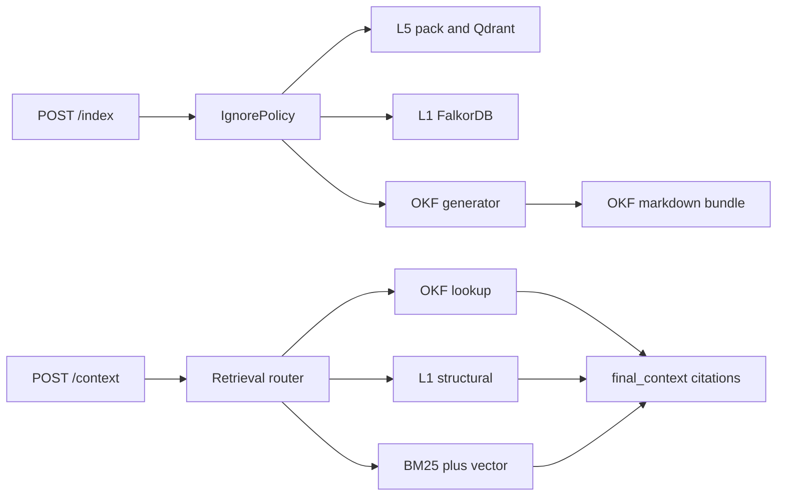

# Implementation Plan: EP-013 OKF Primary Knowledge Format

**Branch**: `feature/ep-013-okf-primary-knowledge` | **Date**: 2026-07-28 | **Spec**: [spec.md](./spec.md)

**Input**: Approved feature direction for US-046 (generate OKF), US-047 (OKF-first retrieval), and US-048 (vector fallback).

## Summary

EP-013 introduces Google Open Knowledge Format (OKF) v0.2 as ContextOS's **Proposed** canonical portable knowledge exchange layer. During Confirmed `POST /index`, FastAPI generates a repository-scoped OKF bundle from eligible architecture docs, Spec Kit artifacts, backlog evidence, and selected EP-006 L1 metadata. During Confirmed `POST /context`, FastAPI prefers OKF concept/link lookup, then existing L1 structural enrichment, then existing L5 BM25/vector hybrid search as fallback. FalkorDB and Qdrant remain runtime stores; no Confirmed API field or endpoint is added.

## Technical Context

**Language/Version**: Python 3.11 / FastAPI (Confirmed current orchestrator).

**Primary Dependencies**: Existing FastAPI, IgnorePolicy, L5 pack/search, EP-006 L1 services. Proposed OKF support needs only local markdown/YAML parsing (stdlib + existing PyYAML if present, or minimal parser). No new graph DB. No external OKF SaaS.

**Storage**: Proposed on-disk OKF bundle under orchestrator pack-cache sibling path `CONTEXTOS_OKF_CACHE_DIR` / `{repo}/okf/` (**Proposed** default for OQ-OKF-01). FalkorDB and Qdrant unchanged.

**Testing**: Existing pytest layouts; add unit/integration/contract/eval coverage for generation, privacy, OKF-first hit, and vector fallback.

**Target Platform**: Local/VPC Docker Compose POC (Confirmed). No new Compose service required.

**Constraints**: Preserve Confirmed `/index` and `/context` shapes; apply ignore policy before generation; no index-time external LLM; metadata-only concepts; MCP remains stateless.

**Scale/Scope**: US-046–US-048 only. Excludes Attested Computation runtime, external connectors, blast/visualization, L4, L6 delivery, client UX work.

## ContextOS Technical Impact

| Layer | Plan impact |
|---|---|
| L5 | **Affected.** Retrieval precedence changes: OKF before hybrid search; Qdrant remains fallback. |
| L1 | Dependency: optional metadata export into OKF concepts; FalkorDB not replaced. |
| L2 | Adjacent Proposed curated-doc concepts only; not full V2 connectors. |
| L3 / L4 / L6 | N/A |

**Surfaces**: FastAPI indexing + context composition only. MCP regression pass-through. CLI/VS Code/dashboards N/A.

## Constitution Check

| Gate | Status | Notes |
|---|---|---|
| I — Evidence-first | Pass | User-directed OKF labeled Proposed; BRD stores preserved. |
| II — Six-layer integrity | Pass with roadmap note | Does not claim L2 connector completion; L5/L1 responsibilities preserved. |
| III — Privacy | Pass with obligations | Reuse IgnorePolicy; metadata-only bodies. |
| IV — Measurable claims | Conditional | Fixture harnesses required; no pass claims pre-execution. |
| V — Boundaries | Pass | FastAPI owns OKF policy; clients thin. |
| Roadmap governance | Pass with explicit exception | User-directed Proposed increment; must not reorder MVP/V1 completion claims or invent V2 connector done-ness. |

## Project Structure

```text
specs/ep-013-okf-primary-knowledge/
├── spec.md
├── plan.md
├── tasks.md
└── validation-report.md

services/orchestrator/app/
├── services/okf_generate.py          # Proposed
├── services/okf_retrieve.py          # Proposed
├── adapters/okf_bundle.py            # Proposed read/write
├── services/l5_index.py              # integrate generation
└── api/context.py                    # integrate OKF-first composition
```

## Technical Approach

### Confirmed architecture reused

1. `POST /index` → `run_index` after IgnorePolicy / `walk_allowed_files`.
2. `POST /context` → pack load → hybrid_search → optional L1/L3 enrichment inside `final_context`.
3. Privacy and no-exfil invariants from EP-001/EP-005.

### Approved implementation design (Proposed)

1. **OKF generator (`okf_generate`)**: After eligibility boundary (and after L1 persistence when available), scan allowed markdown/doc paths matching FR-002 source classes plus selected L1 entity summaries. Emit one concept file per source unit with:
   - required `type` (e.g. `Architecture Doc`, `Spec`, `User Story`, `Structural Entity`)
   - `title`, `description`, `tags`
   - `generated: { by: process:contextos-okf-generator, at: <iso8601> }`
   - `sources: [{ uri: <repo-relative-path>, ... }]`
   - `repo`, `index_revision` as producer extensions
   - markdown body with short summary + links to related concepts
2. **Bundle location (OQ-OKF-01 default)**: `{okf_cache_dir}/{repo_name}/` with `index.md` listing concepts. Not committed into user repos by default.
3. **OKF retrieve (`okf_retrieve`)**: Exact/token-normalized match over concept titles, IDs, tags, and descriptions (OQ-OKF-02 default). Expand ≤N linked concepts. Return cited block for `/context`.
4. **Retrieval order**: OKF hit → existing L1 structural enrichment → L5 hybrid BM25/vector fallback. Low-confidence/miss skips fabrication.
5. **API**: No new Confirmed fields. Trace notes: `okf_status=hit|miss|error`, counts/timings only.
6. **Attested Computation**: Documented as later optional; not implemented.



## Data Model Changes

| Item | Decision |
|---|---|
| Bundle | Directory of `.md` concepts; reserved `index.md` / `log.md` per OKF |
| Concept ID | Path relative to bundle root without `.md` |
| Required frontmatter | `type` |
| ContextOS extensions | `repo`, `index_revision`, `sources`, `generated` |
| Bodies | Summary/metadata only; no full source duplication |
| Count in `/index` | No Confirmed field change (OQ-OKF-03 default) |

## API / Contract Impact

| Endpoint | Change |
|---|---|
| `POST /index` | Behavior: generate OKF after eligibility. Response shape unchanged. |
| `POST /context` | Behavior: OKF-first composition. Response shape unchanged. |
| Health | No new fields required. |

## Privacy / Security

- Consume only IgnorePolicy-allowed paths and already-persisted L1 metadata.
- Never embed excluded secret content into concepts.
- No external LLM during generation.
- Telemetry: counts/timings/status only.

## Testing Strategy

- Unit: frontmatter emission, Concept ID stability, link rewriting, malformed skip.
- Security: excluded paths never become sources.
- Integration: index fixture → bundle on disk; `/context` OKF hit without embeddings; `/context` miss → hybrid fallback.
- Contract: OpenAPI Confirmed properties unchanged.
- Eval (opt-in): grounding precision/recall on small OKF fixture; latency p50/p95 recorded, not claimed.

## Performance Considerations

- Generation is local FS write; measure on Spec Kit-sized fixture.
- Retrieval is lexical over small curated bundle first; vector path unchanged for miss.
- No 1M-LOC OKF claim in this increment.

## Risks

| Risk | Mitigation |
|---|---|
| OKF over-trusted without provenance | Require `sources`/`generated`; skip fabrication |
| Roadmap confusion with V2 L2 | Label L2-adjacent; exclude connectors |
| Retrieval regression if OKF blocks fallback | Explicit miss → L5 path tests |
| Bundle path pollution of user repos | Default to orchestrator cache dir |

## Open Questions Resolution Defaults

| ID | Default for implementation |
|---|---|
| OQ-OKF-01 | Orchestrator cache: `CONTEXTOS_OKF_CACHE_DIR` defaulting beside pack cache |
| OQ-OKF-02 | Exact + token-normalized title/id/tag match; no embedding required for OKF hit |
| OQ-OKF-03 | Do not change Confirmed `/index` fields |
| OQ-OKF-04 | Spec Kit proceeds; backlog sync is a documentation task |

## Complexity Tracking

Not applicable — no constitution violation. New modules follow existing service/adapter split.
